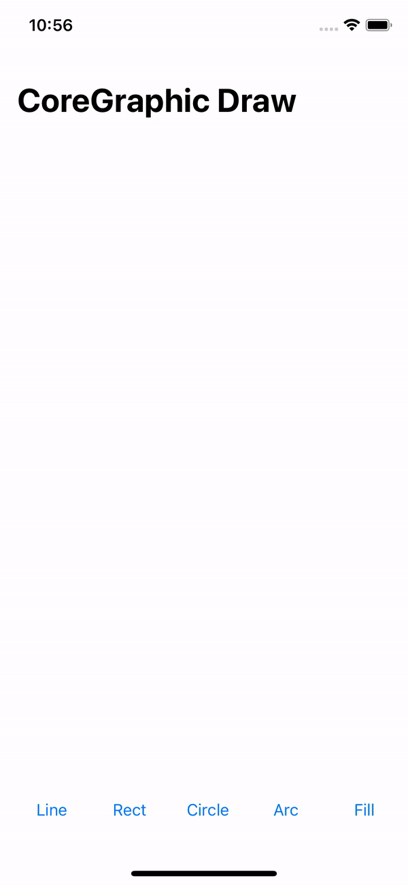

# CoreGraphics_SimpleDraw

> **Swift / CoreGraphics**

- Basic of CoreGraphics Draw
- Draw Line, Rectangle, Circle, Arc and Fill Color with CoreGraphics

### Preview

### **Reference**

[Core Graphics Tutorial: Gradients and Contexts](https://www.raywenderlich.com/10946920-core-graphics-tutorial-gradients-and-contexts)