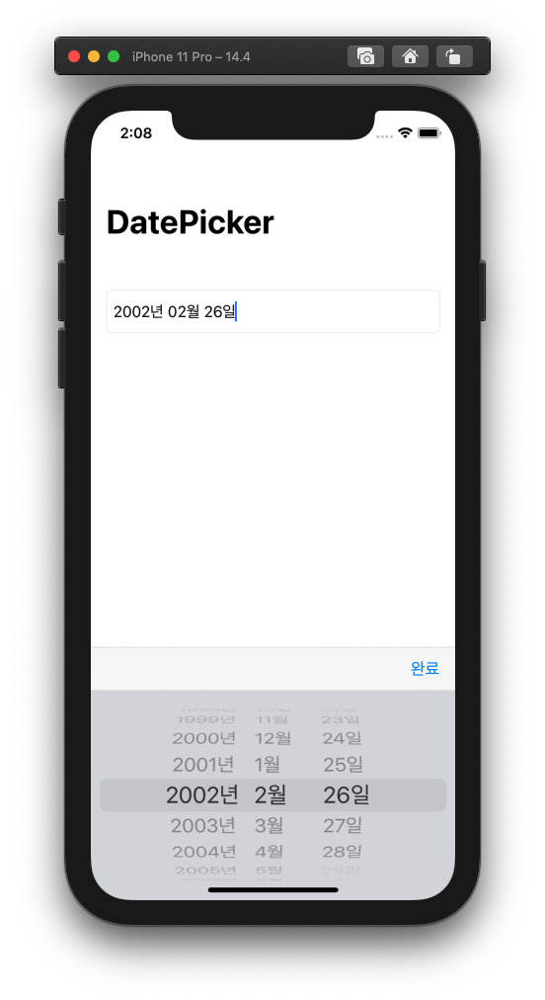

# Swift_URLSession

> **Swift / URLSession / HTTP / Json / Result Type**

- HTTP Json Communication with URLSession
- Additional, use Result Type
- Need for improvement : Code understanding, Clean Code, Code Reuse

### Preview

### To-do

- [ ]  Use Model
- [ ]  Understand Code
- [ ]  etc...
