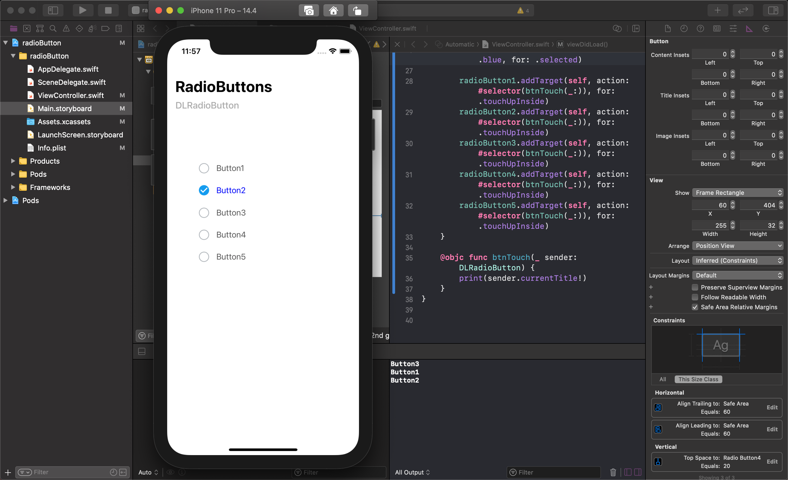

# Swift_textField_EditingChanged

> **Swift / [Linetextfield(NovichenkoAnton)](https://github.com/NovichenkoAnton/LineTextField) / Editing Changed**

- Change Button color/enable from getting LinetextField Text
- Learn Editing Change, email/password validation check

### Preview

**Reference**

[How to Get UITextField Text Editing Changed Events for User Input Validation - Swift Tips 1](https://www.youtube.com/watch?v=XUH1O1BTUvo)
