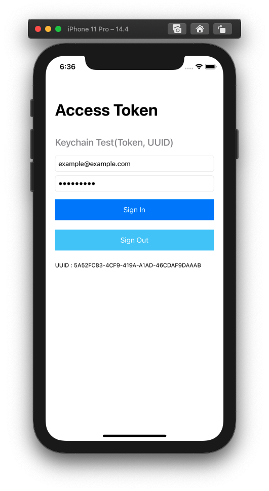

# Swift_KeyChain

> **Swift / KeyChain / Token / UUID**

- Save Token and UUID with KeyChain Service
- Create initial UUID and save, so can us it as a unique value later

### Preview

### Reference

- 꼼꼼한 재은 씨의 스위프트 실전편
