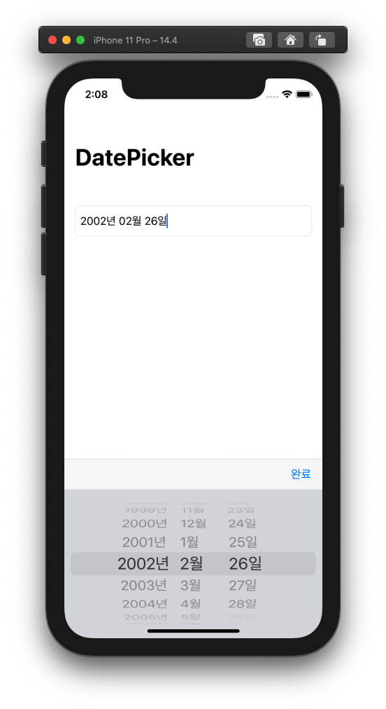

# Swift_DatePicker

> **TextField / DatePicker / ToolBar**

- DatePicker as InputView to TextField
- Create DatePicker(.wheels) and update Textfield's text
- Use Korean Locale
- Custom DateFormat(yyyy년 MM월 dd일)

### Preview

### **Reference**

[DatePicker as InputView to TextField in Swift iOS 14](https://www.youtube.com/watch?v=10jI_aIpzTY&t=11s)