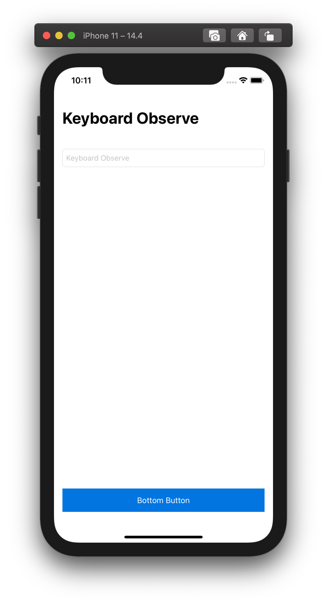
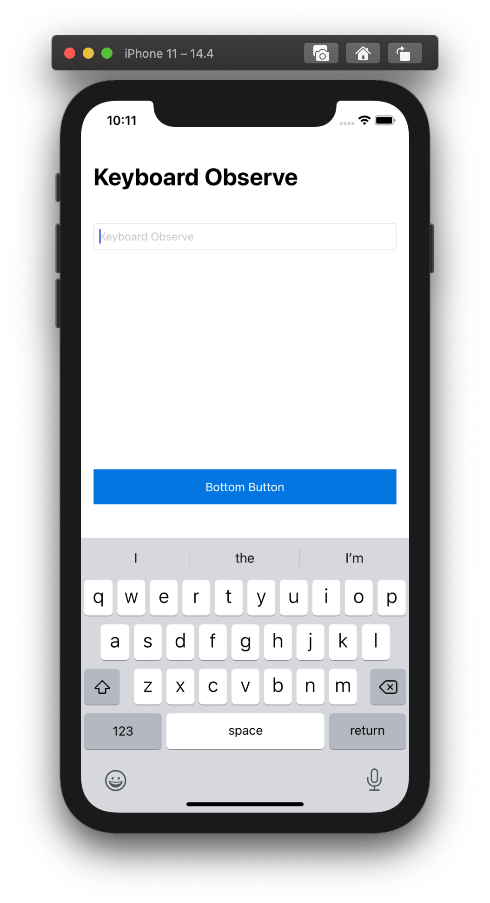

# Swift_KeyboardObserve

> **Swift / KeyboardObserve / NotificationCenter**

- To auto adjust Bottom Button space when Keyboard show/hide
- Use Notification Center and adjust Bottom Button's Constraint

### Preview

  
  

